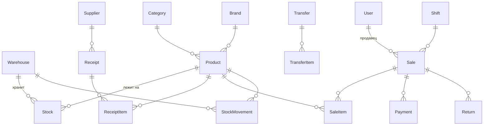

# Техническое задание — AutoZap ERP
### Система учёта и продаж для магазина автозапчастей (бутик-формат)

**Версия:** 1.0
**Дата:** 03.09.2026
**Заказчик:** магазин автозапчастей (1 торговая точка + основной склад)
**Исполнитель:** —

---

## Содержание

1. [Общее описание](#1-общее-описание)
2. [Роли и права доступа](#2-роли-и-права-доступа)
3. [Технологический стек](#3-технологический-стек)
4. [Архитектура](#4-архитектура)
5. [Модель данных](#5-модель-данных)
6. [Бизнес-процессы](#6-бизнес-процессы)
7. [Отчёты и аналитика](#7-отчёты-и-аналитика)
8. [Интерфейс](#8-интерфейс)
9. [API (черновик контракта)](#9-api-черновик-контракта)
10. [Нефункциональные требования](#10-нефункциональные-требования)
11. [Этапы разработки](#11-этапы-разработки)
12. [Развёртывание и эксплуатация](#12-развёртывание-и-эксплуатация)
13. [Риски и решения](#13-риски-и-решения)
14. [Что осознанно НЕ входит в систему](#14-что-осознанно-не-входит-в-систему)
15. [Итоговая рекомендация по стеку](#15-итоговая-рекомендация-по-стеку--коротко)

---

## 1. Общее описание

### 1.1 Цель

Заменить учёт «в тетради/Excel» на веб-систему, которая:

- хранит единый справочник товаров;
- ведёт остатки раздельно по **основному складу** и **складу магазина (витрина)**;
- фиксирует **приход**, **перемещение** между складами и **продажу**;
- автоматически списывает товар с остатков при продаже;
- позволяет продавать по **договорной цене (со скидкой)** с фиксацией размера скидки;
- различает способ оплаты: **Kaspi QR / Карта / Наличные**;
- подсвечивает **дефицит** (мало штук на витрине);
- даёт **дневной отчёт** по деньгам и товарам с графиками.

### 1.2 Ключевой принцип

> Система **не** является полноценной бухгалтерией. Это операционный учёт: «сколько есть — сколько продали — сколько денег в кассе».
> Всё, что не относится к движению товара и денег, — опционально и переносится за пределы MVP.

### 1.3 Формат работы

Веб-сервис (SaaS-style, single-tenant). Доступ по логину с любого устройства: ПК в магазине, ноутбук владельца, телефон продавца. Адаптивный интерфейс, отдельного мобильного приложения нет (при необходимости — PWA, см. §12.2).

### 1.4 Масштаб (расчётные показатели)

| Параметр | Значение |
|---|---|
| Пользователей одновременно | 1–5 |
| Номенклатура (SKU) | 2 000 – 20 000 |
| Продаж в день | 20 – 200 |
| Складов | 2 (расширяемо до N) |
| Торговых точек | 1 (архитектура допускает несколько) |

---

## 2. Роли и права доступа

| Роль | Описание | Права |
|---|---|---|
| **Владелец (Owner)** | Хозяин магазина | Всё. Видит закупочные цены, маржу, все отчёты, управляет пользователями, может удалять/сторнировать документы, задаёт лимит скидки |
| **Менеджер склада (Stock)** | Приёмка товара | Приход, перемещение, инвентаризация, редактирование карточек товара, видит закупочные цены. Не видит финансовые отчёты целиком |
| **Продавец (Seller)** | Работает на кассе | Продажа, возврат (в пределах смены), просмотр остатков и **розничных** цен. **Не видит закупочную цену и маржу**. Скидка — только в пределах лимита |

**Правила:**

- Аутентификация — логин + пароль. Опционально: PIN-код (4 цифры) для быстрого входа на кассовом устройстве.
- Роли реализуются на уровне Django Groups + кастомные permission-классы DRF.
- Каждое действие пишется в журнал аудита (кто, что, когда, старое→новое значение).
- Скидка выше лимита роли → требуется **подтверждение владельца** (ввод его PIN в модальном окне) либо продажа помечается флагом `needs_approval` и попадает в отчёт «Продажи со сверхскидкой».

---

## 3. Технологический стек

### 3.1 Рекомендация

| Слой | Технология | Обоснование |
|---|---|---|
| **Backend** | **Python 3.12 + Django 5.x + Django REST Framework** | Да, Django — правильный выбор. Готовая ORM с транзакциями и блокировками (критично для остатков), встроенная админка (готовый бэк-офис «из коробки» — экономит недели), готовая аутентификация и права, огромная экосистема |
| **БД** | **PostgreSQL 16** | Транзакции, `SELECT FOR UPDATE`, оконные функции для отчётов, полнотекстовый поиск по названию/коду (`pg_trgm` — поиск с опечатками) |
| **Frontend** | **React 18 + TypeScript + Vite + Tailwind CSS + shadcn/ui** | Современный минималистичный интерфейс, огромная библиотека готовых компонентов, быстрый отклик кассы |
| **Стейт/данные** | TanStack Query (React Query) | Кэш, автообновление остатков, оптимистичные обновления |
| **Таблицы** | TanStack Table | Виртуализация — 20 000 SKU без тормозов |
| **Графики** | Recharts | Лёгкий, декларативный, готовые линейные/столбчатые графики |
| **Формы** | React Hook Form + Zod | Валидация на клиенте, тот же контракт что на бэке |
| **Аутентификация** | djangorestframework-simplejwt | JWT access/refresh, работает на всех устройствах |
| **Задачи/фон** | Celery + Redis (**опционально, v2**) | Ночные отчёты, рассылки. В MVP — не нужно |
| **Деплой** | Docker Compose + Nginx + Gunicorn | Один `docker compose up` на VPS |
| **Мониторинг ошибок** | Sentry (free tier) | Ловим падения в проде |

### 3.2 Альтернатива (если нужен минимум трудозатрат)

**Django + HTMX + Alpine.js + Tailwind** — монолит без отдельного фронтенда.
Плюсы: в 1.5–2 раза меньше кода, одна кодовая база, деплой проще, SEO не нужен.
Минусы: менее «приложенческий» отклик, сложнее сделать оффлайн-режим кассы.

> **Вывод:** для магазина на 1 точку HTMX-монолит полностью закрывает задачу и дешевле. Но если планируется рост (несколько точек, мобильное приложение, интеграции) — берём React + DRF.
> **Итоговая рекомендация ТЗ: React + DRF**, так как заказчик хочет «современнее, красивее, минималистичнее» и доступ с телефона.

### 3.3 Готовые open-source компоненты для переиспользования

Не писать с нуля то, что уже есть:

| Задача | Библиотека |
|---|---|
| UI-компоненты (кнопки, модалки, таблицы, тосты) | **shadcn/ui** (Radix UI + Tailwind) — копируется в проект, полностью кастомизируется |
| Иконки | **lucide-react** |
| Импорт/экспорт товаров из Excel | **django-import-export** |
| История изменений записей (аудит) | **django-simple-history** |
| Фильтры в API | **django-filter** |
| Документация API (Swagger) | **drf-spectacular** |
| Мягкое удаление | **django-safedelete** |
| Настройки через .env | **django-environ** |
| Раздача статики | **WhiteNoise** |
| Сканер штрихкодов в браузере | **@zxing/library** или **html5-qrcode** |
| Генерация PDF-чека | **WeasyPrint** |
| Экспорт отчётов в Excel | **openpyxl** |
| CORS | **django-cors-headers** |
| Rate limit / защита | **django-axes** (защита от брутфорса) |

Также можно посмотреть как референс архитектуры (не копировать целиком): **django-oscar** (складская модель), **Frappe/ERPNext** (логика Stock Ledger Entry), **Medusa.js** (модель inventory). Из ERPNext стоит перенять идею **неизменяемого журнала движений (Stock Ledger)** — см. §5.4.

---

## 4. Архитектура

```
[ Браузер: React SPA ]  ← HTTPS →  [ Nginx ]
                                      ├── /api/*  → Gunicorn → Django + DRF
                                      ├── /admin/ → Django Admin (для владельца)
                                      └── /       → собранный React (static)
                                                      ↓
                                            [ PostgreSQL 16 ]
                                                      ↓
                                            [ Ежедневный бэкап → S3 / Object Storage ]
```

**Структура репозитория:**

```
autozap/
├── backend/
│   ├── config/            # settings, urls, wsgi
│   ├── apps/
│   │   ├── accounts/      # пользователи, роли, PIN
│   │   ├── catalog/       # товары, категории, бренды, поставщики
│   │   ├── inventory/     # склады, остатки, движения, приход, перемещение, инвентаризация
│   │   ├── sales/         # продажи, позиции, оплаты, возвраты, смены
│   │   ├── reports/       # агрегаты, дневной отчёт, графики
│   │   └── core/          # общие утилиты, аудит, пагинация, ошибки
│   ├── requirements.txt
│   └── Dockerfile
├── frontend/
│   ├── src/
│   │   ├── pages/         # экраны
│   │   ├── components/    # ui/, shared/
│   │   ├── api/           # клиент, типы, хуки TanStack Query
│   │   ├── lib/           # утилиты, форматтеры (тенге, дата)
│   │   └── store/         # корзина продажи (zustand)
│   ├── package.json
│   └── Dockerfile
├── docker-compose.yml
├── docker-compose.prod.yml
├── .env.example
└── README.md
```

---

## 5. Модель данных

### 5.1 Схема связей



### 5.2 Справочники

#### `Warehouse` — Склад

| Поле | Тип | Описание |
|---|---|---|
| id | UUID | PK |
| name | str(100) | «Основной склад», «Магазин» |
| code | str(20) unique | `MAIN`, `SHOP` |
| kind | choice | `main` / `shop` |
| is_sellable | bool | Можно ли продавать с этого склада (у `MAIN` = false по умолчанию) |
| is_active | bool | |

> Изначально создаются 2 записи. Модель складов сделана универсальной — добавить третий склад можно без переписывания кода.

#### `Category` — Категория

| Поле | Тип | Описание |
|---|---|---|
| id | UUID | |
| name | str(100) | «Тормозная система», «Фильтры», «Масла» |
| parent | FK self, null | Дерево (2 уровня достаточно) |
| is_active | bool | |

#### `Brand` — Производитель

`id`, `name` (Bosch, Mann, Sakura…), `country` (опц.), `is_active`

#### `Supplier` — Поставщик

`id`, `name`, `phone`, `note`, `is_active`
*Нужен только чтобы знать «откуда пришёл товар». Без взаиморасчётов в MVP.*

#### `Product` — Товар (карточка)

**Обязательные поля:**

| Поле | Тип | Описание |
|---|---|---|
| id | UUID | |
| name | str(255) | Название: «Фильтр масляный Toyota Camry 2.5» |
| sku | str(64) **unique** | Внутренний код (можно автогенерацию: `AZ-000123`) |
| oem_code | str(64), index | Оригинальный/каталожный номер производителя — **главное поле поиска** у автозапчастей |
| barcode | str(64), null, unique | Штрихкод (EAN-13). Для сканера |
| brand | FK Brand, null | |
| category | FK Category, null | |
| unit | choice | `шт` / `компл` / `л` / `кг` (по умолчанию `шт`) |
| purchase_price | Decimal(12,2) | Последняя закупочная цена. **Скрыта от продавца** |
| avg_cost | Decimal(12,2) | Средневзвешенная себестоимость (пересчитывается при приходе) — для расчёта маржи |
| sale_price | Decimal(12,2) | Розничная цена по умолчанию (подставляется в чек) |
| min_price | Decimal(12,2), null | Минимально допустимая цена продажи (порог торга). Если пусто — берётся `avg_cost` |
| min_stock | int, default **5** | Порог дефицита для витрины. Настраивается индивидуально |
| is_active | bool | Архивация вместо удаления |

**Дополнительные (полезные, но не критичные) поля:**

| Поле | Описание |
|---|---|
| applicability | Текст: «Toyota Camry 40/50, Lexus ES 2006–2012» — применимость к авто |
| analogs | M2M на Product — аналоги/заменители. *Очень ценно при торге: «этого нет, есть аналог»* |
| location | str(50) — место на полке: «Стеллаж B, полка 3» |
| note | Комментарий |
| created_at / updated_at / created_by | Служебные |

> **Почему `oem_code` важен:** клиент приходит с номером детали. Поиск в системе должен работать по: названию, SKU, OEM-коду, штрихкоду и **частичному совпадению с игнорированием дефисов и регистра** (`90915-YZZD4` == `90915yzzd4`). Реализация: нормализованное поле `search_key` + GIN-индекс `pg_trgm`.
>
> **Осознанно без фото товара:** для бутик-формата (единый склад + одна витрина, продавец физически видит и находит товар по коду/полке) фотография не добавляет ценности, но раздувает базу и дисковое пространство на сервере — особенно на бюджетном VPS. Поле легко добавить позже (`ImageField` + `MEDIA_ROOT`), если понадобится, например, для будущей онлайн-витрины.

### 5.3 Остатки

#### `Stock` — Остаток товара на складе

| Поле | Тип |
|---|---|
| product | FK Product |
| warehouse | FK Warehouse |
| quantity | Decimal(12,3) — дробное для литров/кг |
| updated_at | datetime |

**Constraint:** `unique_together (product, warehouse)`
**Constraint:** `quantity >= 0` (CheckConstraint) — уйти в минус физически невозможно.

> `Stock` — это **кэш быстрого чтения**. Источник истины — `StockMovement` (§5.4). Пересчёт `Stock` из журнала должен быть возможен одной management-командой `python manage.py recalc_stock` — это спасает при любых расхождениях.

### 5.4 Журнал движений (ядро системы)

#### `StockMovement` — неизменяемая запись движения

| Поле | Тип | Описание |
|---|---|---|
| id | UUID | |
| created_at | datetime, index | |
| product | FK Product | |
| warehouse | FK Warehouse | |
| qty_delta | Decimal(12,3) | **+** приход, **−** расход |
| balance_after | Decimal(12,3) | Остаток после операции (для восстановления истории) |
| unit_cost | Decimal(12,2) | Себестоимость единицы на момент операции |
| reason | choice | `receipt` / `transfer_out` / `transfer_in` / `sale` / `return` / `writeoff` / `inventory` |
| doc_type | str | Тип документа-источника |
| doc_id | UUID | ID документа-источника |
| user | FK User | Кто совершил |
| note | text | |

**Правила:**

1. Записи **никогда не редактируются и не удаляются**. Ошибка исправляется обратной (сторнирующей) записью.
2. Любое изменение `Stock` происходит **только** через создание `StockMovement` внутри одной транзакции.
3. Сумма `qty_delta` по (product, warehouse) === `Stock.quantity`. Это инвариант, проверяемый ночной задачей/командой.

### 5.5 Документы движения

#### `Receipt` — Приход товара (на основной склад)

| Поле | Описание |
|---|---|
| number | Автономер `PR-2026-00001` |
| date | Дата документа |
| warehouse | Куда пришло (обычно `MAIN`) |
| supplier | FK, null |
| status | `draft` / `posted` (проведён) / `cancelled` |
| total_amount | Считается по позициям |
| comment, created_by, created_at, posted_at | |

#### `ReceiptItem`

`receipt`, `product`, `quantity`, `purchase_price`, `sale_price` (можно сразу задать новую розничную цену), `amount`

**Логика проведения (`post`):**
- Для каждой позиции: `Stock(+qty)` в целевом складе + `StockMovement(reason=receipt)`.
- Обновляется `Product.purchase_price` = цена последнего прихода.
- Пересчитывается `Product.avg_cost` = `(старый_остаток × старый_avg_cost + приход_кол × приход_цена) / (старый_остаток + приход_кол)`.
- Если в позиции указана `sale_price` — обновляется `Product.sale_price`.
- Документ становится `posted`, редактирование запрещено. Отмена = сторно-движения + статус `cancelled`.

#### `Transfer` — Перемещение (Основной склад → Магазин)

| Поле | Описание |
|---|---|
| number | `TR-2026-00001` |
| date, from_warehouse, to_warehouse | |
| status | `draft` / `posted` / `cancelled` |
| created_by, comment | |

`TransferItem`: `product`, `quantity`

**Логика проведения:** проверка достаточности остатка на `from_warehouse` (с `SELECT FOR UPDATE`) → `−qty` из источника (`transfer_out`) → `+qty` в приёмник (`transfer_in`). Обе записи в одной транзакции. Себестоимость переносится без изменений.

> **Удобство:** на экране перемещения кнопка **«Пополнить дефицит»** — автоматически подставляет в документ все товары, у которых остаток в магазине < `min_stock`, в количестве `min_stock × 2 − текущий_остаток` (если есть на основном складе).

#### `Inventory` — Инвентаризация (пересчёт)

`number`, `date`, `warehouse`, `status`.
`InventoryItem`: `product`, `qty_system` (по системе), `qty_fact` (по факту), `diff`.
При проведении — корректирующие движения `reason=inventory`. Позволяет привести систему в соответствие реальности без «ручного редактирования остатка».

#### `WriteOff` — Списание

Брак, порча, потеря. `number`, `date`, `warehouse`, `reason_text`. Позиции: `product`, `quantity`. Движения `reason=writeoff`. Попадает в отчёт «Потери».

### 5.6 Продажа

#### `Shift` — Кассовая смена (рекомендуется, но можно вынести в v1.1)

`id`, `opened_at`, `closed_at`, `opened_by`, `closed_by`, `cash_start`, `cash_end_fact`, `cash_end_system`, `status`.
Смысл: продавец утром открывает смену, вечером закрывает — система показывает, сколько наличных должно быть в ящике, продавец вводит фактическую сумму, фиксируется расхождение. **Это главный инструмент контроля владельца.**

#### `Sale` — Продажа (чек)

| Поле | Тип | Описание |
|---|---|---|
| id | UUID | |
| number | str | `S-2026-000123` |
| created_at | datetime, index | |
| warehouse | FK | Откуда списан товар (обычно `SHOP`) |
| seller | FK User | |
| shift | FK Shift, null | |
| customer_name | str, null | Опционально (для постоянников) |
| customer_phone | str, null | |
| subtotal | Decimal | Сумма по базовым ценам |
| discount_total | Decimal | Общая скидка (в тенге) |
| total | Decimal | К оплате = subtotal − discount_total |
| cost_total | Decimal | Суммарная себестоимость (для маржи) |
| profit | Decimal | total − cost_total |
| status | choice | `completed` / `returned` / `partially_returned` / `cancelled` |
| comment | text | |
| needs_approval | bool | Скидка превысила лимит роли |
| approved_by | FK User, null | |

#### `SaleItem` — Позиция чека

| Поле | Описание |
|---|---|
| sale | FK |
| product | FK |
| quantity | Decimal(12,3) |
| base_price | Цена из карточки товара на момент продажи |
| final_price | **Фактическая цена за единицу** (после торга) |
| discount_amount | `(base_price − final_price) × quantity` — вычисляемое |
| discount_percent | Вычисляемое, для отчётов |
| unit_cost | Себестоимость единицы на момент продажи (снимок `avg_cost`) |
| amount | `final_price × quantity` |
| returned_qty | Сколько из этой позиции возвращено |

> **Ключевое требование заказчика реализовано здесь:** товар стоит 5 000 ₸, клиент сторговался до 4 000 ₸ → `base_price=5000`, `final_price=4000`, `discount_amount=1000`. В отчёте видно и выручку, и сколько «отдали скидками».

#### `Payment` — Оплата

| Поле | Описание |
|---|---|
| sale | FK |
| method | choice: `cash` (Наличные) / `kaspi_qr` (Kaspi QR) / `card` (Карта) / `transfer` (Перевод, опц.) |
| amount | Decimal |

> Отдельная таблица (а не поле в `Sale`) нужна для **смешанной оплаты**: «3 000 наличными + 2 000 Kaspi QR». Это реально встречается. Если смешанная оплата не нужна — всё равно оставляем таблицу, просто с одной записью.
> Валидация: `SUM(payments.amount) == sale.total`.

#### `Return` — Возврат

`id`, `number`, `sale` (FK), `created_at`, `created_by`, `reason`, `total_amount`, `refund_method`.
`ReturnItem`: `sale_item`, `quantity`, `amount`.
При проведении: `+qty` на склад (`reason=return`), `Sale.status` → `returned`/`partially_returned`, сумма вычитается из выручки дня.

### 5.7 Служебные

- **`AuditLog`** (через `django-simple-history` + собственная таблица для действий): `user`, `action`, `object_type`, `object_id`, `changes (JSON)`, `ip`, `created_at`.
- **`Settings`** (singleton): валюта (₸), название магазина, порог дефицита по умолчанию (5), лимит скидки для продавца (%), включён ли контроль смен, часовой пояс (Asia/Almaty).

---

## 6. Бизнес-процессы

### 6.1 Приход товара

```
Менеджер → «Приход» → «Новый приход»
   ├── выбирает склад (Основной) и поставщика
   ├── добавляет позиции:
   │     ├── поиск существующего товара по коду/названию
   │     └── ИЛИ «+ Создать товар» — карточка создаётся прямо в форме прихода
   ├── указывает количество и закупочную цену
   ├── (опц.) указывает новую розничную цену
   └── «Провести» → МОДАЛЬНОЕ ПОДТВЕРЖДЕНИЕ (позиции, итоговая сумма)
         └── остатки +, себестоимость пересчитана, документ заблокирован
```

**Требование:** создание товара «на лету» из формы прихода обязательно — иначе менеджер будет прыгать между экранами и бросит систему.

### 6.2 Перемещение на витрину

```
Менеджер → «Перемещение» → «Новое»
   ├── Основной склад → Магазин
   ├── Кнопка «Пополнить дефицит» (автоподбор) ИЛИ ручной выбор
   ├── Проверка: нельзя переместить больше, чем есть
   └── «Провести» → модальное подтверждение → остатки перераспределены
```

### 6.3 Продажа (главный экран)

```
Продавец → «Продажа»
   │
   ├── [1] ПОИСК ТОВАРА
   │      строка поиска в фокусе по умолчанию
   │      ищет по: названию / SKU / OEM-коду / штрихкоду
   │      сканер штрихкода (камера телефона или USB-сканер)
   │      в выдаче видно: название, цена, ОСТАТОК В МАГАЗИНЕ (цветом)
   │
   ├── [2] ДОБАВЛЕНИЕ В ЧЕК
   │      клик/Enter → позиция в корзине
   │      количество редактируется (+/− и ручной ввод)
   │      блокировка: нельзя добавить больше, чем на остатке
   │
   ├── [3] ТОРГ / СКИДКА          ← ключевая функция
   │      у каждой позиции поле «Цена» редактируемое
   │      ввод 4000 вместо 5000 → сразу видно: «Скидка 1 000 ₸ (20%)»
   │      альтернативно: поле «% скидки» или «скидка на весь чек»
   │      ├── если цена < min_price → предупреждение жёлтым
   │      ├── если цена < себестоимости → БЛОКИРОВКА или подтверждение владельца
   │      └── если скидка > лимита роли → требуется PIN владельца
   │
   ├── [4] СПОСОБ ОПЛАТЫ
   │      три большие кнопки: [Наличные] [Kaspi QR] [Карта]
   │      ссылка «Разделить оплату» → несколько методов с суммами
   │      при наличных: поле «Получено» → автоподсчёт сдачи
   │
   └── [5] МОДАЛЬНОЕ ОКНО ПОДТВЕРЖДЕНИЯ    ← обязательное требование
          ┌────────────────────────────────────┐
          │  Подтвердите продажу               │
          │  ─────────────────────────────     │
          │  Фильтр масляный   ×2   8 000 ₸    │
          │  Колодки передние  ×1   4 000 ₸    │
          │  ─────────────────────────────     │
          │  Сумма по прайсу       14 000 ₸    │
          │  Скидка               − 2 000 ₸    │
          │  ИТОГО К ОПЛАТЕ        12 000 ₸    │
          │  Оплата: Kaspi QR                  │
          │  ─────────────────────────────     │
          │  [ Отмена ]      [ Подтвердить ]   │
          └────────────────────────────────────┘
                    ↓ Подтвердить
          транзакция: списание остатков + движения + чек + оплата
                    ↓
          Тост «Продажа №S-2026-000123 проведена» + (опц.) печать/PDF чека
          Форма очищается, фокус снова в поиске
```

**Технические требования к продаже:**

1. Вся операция — **одна атомарная транзакция БД**. Падение на любом шаге = откат целиком.
2. `SELECT ... FOR UPDATE` на строках `Stock` — исключает продажу одного товара двумя продавцами одновременно.
3. **Идемпотентность:** клиент генерирует `idempotency_key` (UUID) при открытии модалки. Повторный POST с тем же ключом возвращает уже созданный чек, а не дубль. Защищает от двойного клика и повторной отправки при плохом интернете.
4. Кнопка «Подтвердить» блокируется на время запроса (защита от даблклика на уровне UI).
5. Цены и себестоимость **фиксируются снимком** в `SaleItem` — последующее изменение карточки товара не искажает историю.

### 6.4 Возврат

Продавец находит чек (по номеру, дате или последние 20 продаж) → выбирает позиции и количество → указывает причину → модальное подтверждение → товар возвращается на склад, деньги вычитаются из выручки дня. Возврат старше N дней (настройка, по умолчанию 14) — только с подтверждением владельца.

### 6.5 Контроль дефицита

| Условие (остаток в магазине) | Индикация |
|---|---|
| `qty = 0` | Серый/зачёркнутый бейдж «Нет в наличии» |
| `0 < qty < min_stock` (по умолчанию 5) | **Красный** бейдж — дефицит |
| `min_stock ≤ qty < min_stock × 2` | **Жёлтый** бейдж — заканчивается |
| `qty ≥ min_stock × 2` | Зелёный / нейтральный |

- Виджет на дашборде: «Дефицит: 12 позиций» → клик → отфильтрованный список.
- В списке дефицита показывается остаток на **основном складе**, чтобы сразу понять — можно ли пополнить витрину или надо заказывать у поставщика.
- Кнопка «Создать перемещение из этого списка» — одним нажатием.
- (v2) Уведомление владельцу в Telegram при появлении новой дефицитной позиции.

---

## 7. Отчёты и аналитика

### 7.1 Дашборд (главная страница)

Верхний ряд — карточки за **сегодня** (со сравнением со вчера в %):

| Показатель | Пример |
|---|---|
| Выручка | 245 000 ₸ ▲12% |
| Количество продаж (чеков) | 18 |
| Средний чек | 13 611 ₸ |
| Валовая прибыль | 68 400 ₸ |
| Сумма скидок | 14 200 ₸ |
| Позиций в дефиците | 12 |

Ниже:

- **График 1:** Выручка по дням — линейный/столбчатый, переключатели «7 дней / 30 дней / Месяц».
- **График 2:** Структура оплат — donut: Наличные / Kaspi QR / Карта (сумма и %).
- **Топ-10 товаров** за период — по выручке и по количеству.
- **Последние 10 продаж** — лента с суммой, продавцом, способом оплаты.

### 7.2 Дневной отчёт (Z-отчёт)

Отдельная страница «Отчёт за день» с выбором даты:

**Финансы**
- Выручка всего; в разрезе способов оплаты (наличные / Kaspi QR / карта); возвраты (сумма); чистая выручка; себестоимость проданного; валовая прибыль; рентабельность %; сумма предоставленных скидок; средняя скидка %.

**Товары**
- Всего продано позиций (шт); количество чеков; средний чек; таблица всех проданных товаров: наименование, код, кол-во, сумма по прайсу, сумма факт, скидка, себестоимость, прибыль.

**Продавцы** (если их несколько)
- По каждому: чеков, выручка, средняя скидка %, прибыль.

**Смена** (если включён контроль смен)
- Наличных на начало / должно быть в кассе / фактически / расхождение.

**Действия:** «Экспорт в Excel», «Скачать PDF», «Печать».

### 7.3 Прочие отчёты

| Отчёт | Содержание |
|---|---|
| **Остатки** | Товар, склад, кол-во, себестоимость, сумма остатка. Фильтры по категории/бренду/дефициту. Экспорт в Excel |
| **Движение товара** | По конкретному товару: вся история (приход, перемещение, продажа, возврат, списание) с остатком после каждой операции |
| **Продажи за период** | Список чеков с фильтрами: дата, продавец, способ оплаты, сумма от/до, «только со скидкой», «только сверхскидки» |
| **Анализ скидок** | Сколько денег «отдано» скидками за период, по товарам и по продавцам. *Инструмент контроля торга* |
| **Неликвиды** | Товары, которые не продавались N дней (по умолчанию 90), с суммой замороженных денег |
| **Прибыльность** | Товары/категории по марже — что действительно зарабатывает |
| **Потери** | Списания и расхождения при инвентаризации |

### 7.4 Правила расчёта

- Все денежные значения — `Decimal`, округление до 2 знаков, метод `ROUND_HALF_UP`.
- Валюта — тенге (₸), формат `12 345 ₸` (пробел-разделитель тысяч, без копеек в интерфейсе, но с копейками в БД).
- Прибыль = `SUM(SaleItem.amount) − SUM(SaleItem.unit_cost × quantity)`.
- Все агрегаты считаются в БД (`annotate`/`aggregate`), не в Python.
- Часовой пояс расчёта дня — **Asia/Almaty (UTC+5)**. Отчётный день = календарные сутки в этом поясе.
- Для дашборда — кэш на 60 секунд (Redis или локальный memcache), чтобы не грузить БД при частом обновлении.

---

## 8. Интерфейс

### 8.1 Карта экранов

```
├── Вход (логин/пароль, опц. PIN)
├── 📊 Дашборд                    — все роли (объём данных зависит от роли)
├── 🛒 Продажа                    — продавец, владелец
├── 📦 Товары
│     ├── Список (поиск, фильтры, остатки по обоим складам)
│     ├── Карточка товара (инфо, остатки, история движений, продажи)
│     └── Создать / Редактировать
├── 🏬 Склад
│     ├── Остатки (по складам, с подсветкой дефицита)
│     ├── Приход (список + документ)
│     ├── Перемещение (список + документ)
│     ├── Инвентаризация
│     └── Списание
├── 🧾 Продажи
│     ├── Журнал чеков (фильтры)
│     ├── Чек (детали, кнопка «Возврат»)
│     └── Возвраты
├── 📈 Отчёты
│     ├── Дневной отчёт
│     ├── Остатки / Движение / Продажи / Скидки / Неликвиды / Прибыльность
├── 💰 Смены (открыть / закрыть / история)          — опционально
└── ⚙️ Настройки                   — владелец
      ├── Пользователи и роли
      ├── Склады, категории, бренды, поставщики
      └── Параметры (порог дефицита, лимит скидки, реквизиты магазина)
```

### 8.2 Дизайн-система

**Принцип:** современный минимализм — много воздуха, мало линий, крупные читаемые цифры. Не «1С из 2005 года».

| Элемент | Решение |
|---|---|
| Сетка | Боковое меню (сворачивается в иконки), контент — карточки на нейтральном фоне |
| Шрифт | Inter (или системный стек). Цифры — табличные (`font-variant-numeric: tabular-nums`), чтобы суммы выравнивались |
| Радиусы | 12–16 px у карточек, 8–10 px у кнопок и полей |
| Тени | Минимальные, вместо теней — тонкие границы `1px` |
| Тема | Светлая по умолчанию + **тёмная тема** (переключатель), настройки в CSS-переменных |
| Плотность | Компактные таблицы (высота строки 40–44 px), но кнопки касания на мобильном ≥ 44 px |
| Анимации | Только функциональные: 150 мс на hover/открытие модалки. Ничего декоративного |

**Цветовая логика (семантика, не украшение):**

| Смысл | Цвет |
|---|---|
| Акцент / основное действие | Тёмно-синий / графитовый |
| Успех, наличие товара | Зелёный |
| Предупреждение, «заканчивается» | Янтарный |
| Дефицит, ошибка, отрицательная маржа | Красный |
| Нейтральные данные | Серая шкала |

Цвет статуса всегда дублируется **текстом или иконкой** (доступность, дальтонизм, печать в ч/б).

### 8.3 Мобильная адаптация

- Экран **Продажи** — приоритет №1 для мобильного: одноколоночный режим, крупные кнопки способов оплаты, корзина в выдвижной панели снизу (bottom sheet), сканер через камеру телефона.
- Таблицы на узких экранах превращаются в карточки (название крупно, показатели строками).
- Боковое меню → нижняя навигация из 4–5 иконок.
- Все критичные действия достижимы большим пальцем одной руки.

### 8.4 Эргономика (важно для скорости работы)

| Требование | Детали |
|---|---|
| Фокус | На экране продажи курсор всегда в поле поиска после каждого действия |
| Горячие клавиши | `F2` — новая продажа, `F4` — фокус в поиск, `Enter` — добавить найденный товар, `F9` — оплатить, `Esc` — закрыть модалку |
| Поиск | Debounce 250 мс, поиск начинается с 2 символов, показывает до 20 результатов, толерантен к дефисам/регистру/раскладке клавиатуры (рус/eng) |
| Обратная связь | Тосты вместо `alert()`. Скелетоны вместо спиннеров |
| Ошибки | Человеческим языком: «Недостаточно товара: на витрине 3 шт, в чеке 5 шт», а не «Error 400» |
| Оффлайн | Индикатор потери связи; кнопка «Подтвердить» отключается, чтобы не создать «фантомный» чек |
| Подтверждения | Модальное окно для: продажи, возврата, проведения прихода/перемещения/списания, удаления чего-либо |

---

## 9. API (черновик контракта)

Базовый префикс `/api/v1/`. Аутентификация: `Authorization: Bearer <JWT>`.

### Аутентификация
```
POST   /auth/login/            → {access, refresh, user{id, name, role, permissions}}
POST   /auth/refresh/
POST   /auth/logout/
GET    /auth/me/
```

### Справочники
```
GET    /products/?search=&category=&brand=&warehouse=&low_stock=true&page=
GET    /products/{id}/
POST   /products/
PATCH  /products/{id}/
GET    /products/{id}/movements/       # история движений
GET    /products/search/?q=            # быстрый поиск для кассы (лёгкий ответ)
GET    /categories/  /brands/  /suppliers/  /warehouses/
```

### Склад
```
GET    /stock/?warehouse=&low_stock=true
GET    /stock/low/                      # дефицит

GET    /receipts/            POST /receipts/
POST   /receipts/{id}/post/             # провести
POST   /receipts/{id}/cancel/

GET    /transfers/           POST /transfers/
POST   /transfers/{id}/post/
GET    /transfers/suggest/              # автоподбор пополнения дефицита

POST   /inventories/   POST /inventories/{id}/post/
POST   /writeoffs/     POST /writeoffs/{id}/post/
```

### Продажи
```
POST   /sales/                          # создание чека (атомарно)
GET    /sales/?date_from=&date_to=&seller=&payment_method=&has_discount=
GET    /sales/{id}/
POST   /sales/{id}/return/
GET    /sales/{id}/receipt.pdf
```

**Пример запроса `POST /sales/`:**

```json
{
  "idempotency_key": "b3f1c2e0-8a5d-4c11-9f2b-7d6e5a4c3b21",
  "warehouse": "SHOP",
  "items": [
    { "product_id": "…", "quantity": 2, "final_price": 4000 },
    { "product_id": "…", "quantity": 1, "final_price": 4000 }
  ],
  "payments": [
    { "method": "kaspi_qr", "amount": 12000 }
  ],
  "customer_name": null,
  "comment": ""
}
```

**Ответ `201`:**

```json
{
  "id": "…",
  "number": "S-2026-000123",
  "created_at": "2026-09-03T14:22:11+05:00",
  "subtotal": 14000,
  "discount_total": 2000,
  "total": 12000,
  "profit": 3400,
  "items": [ … ],
  "payments": [ … ]
}
```

**Ошибка при нехватке остатка `409`:**

```json
{
  "code": "insufficient_stock",
  "detail": "Недостаточно товара на складе",
  "errors": [
    { "product_id": "…", "product_name": "Фильтр масляный", "requested": 5, "available": 3 }
  ]
}
```

### Отчёты
```
GET    /reports/dashboard/?period=today|7d|30d
GET    /reports/daily/?date=2026-09-03
GET    /reports/sales-chart/?from=&to=&group_by=day|week
GET    /reports/top-products/?from=&to=&limit=10&by=revenue|qty
GET    /reports/discounts/?from=&to=
GET    /reports/stock/?warehouse=
GET    /reports/dead-stock/?days=90
GET    /reports/{name}/export/?format=xlsx
```

**Общие правила API:**

- Пагинация: `page` + `page_size` (по умолчанию 50, максимум 200), ответ `{count, next, previous, results}`.
- Все даты — ISO 8601 с таймзоной.
- Деньги — строки с 2 знаками (`"12000.00"`), чтобы не потерять точность в JS.
- Единый формат ошибок: `{code, detail, errors[]}`.
- Автодокументация — `drf-spectacular` → `/api/docs/`.
- Типы TypeScript для фронта генерируются из OpenAPI-схемы (`openapi-typescript`) — контракт не расходится.

---

## 10. Нефункциональные требования

### 10.1 Целостность данных

1. Все многошаговые операции — в `transaction.atomic()`.
2. `SELECT FOR UPDATE` на строках `Stock` при любом расходе.
3. `CheckConstraint quantity >= 0` на уровне БД — последний рубеж.
4. Проведённые документы неизменяемы; исправление — только сторно.
5. Команда `manage.py verify_stock` сверяет `Stock` с суммой `StockMovement` и выводит расхождения.
6. Идемпотентность создания продажи (см. §6.3).

### 10.2 Производительность

| Операция | Целевое время |
|---|---|
| Поиск товара на кассе | < 200 мс (при 20 000 SKU) |
| Проведение продажи | < 500 мс |
| Загрузка дашборда | < 1 с |
| Отчёт за месяц | < 3 с |

Меры: индексы на `sku`, `oem_code`, `barcode`, `Sale.created_at`, `StockMovement(product, warehouse, created_at)`; GIN + `pg_trgm` для поиска; `select_related`/`prefetch_related` везде; виртуализация длинных таблиц на фронте.

### 10.3 Безопасность

- HTTPS обязателен (Let's Encrypt, автопродление).
- Пароли — Django PBKDF2/Argon2. Минимум 8 символов.
- JWT: access 30 мин, refresh 14 дней, refresh-ротация.
- `django-axes`: блокировка после 5 неудачных попыток входа на 15 минут.
- CORS — только домен фронтенда. CSRF для сессионных эндпоинтов.
- Закупочные цены и маржа **не отдаются в API** пользователю с ролью «Продавец» (фильтрация на уровне сериализатора, не на фронте).
- Все изменения справочников и документов — в журнал аудита.
- Секреты — только в `.env`, никогда в репозитории.

### 10.4 Надёжность и данные

- **Бэкап PostgreSQL: ежедневно в 03:00**, хранение 30 дней, копия во внешнее объектное хранилище. Раз в месяц — тестовое восстановление.
- Логи Django и Nginx — ротация, хранение 30 дней.
- Sentry для ошибок.
- Healthcheck-эндпоинт `/api/health/` для мониторинга (UptimeRobot).
- Целевая доступность: 99% (магазин работает днём; ночное окно обслуживания допустимо).

### 10.5 Локализация

- Интерфейс — **русский** (основной). Архитектура — с `i18n`, чтобы позже добавить казахский без переписывания.
- Формат чисел: `12 345 ₸`. Даты: `03.09.2026`, время `14:22`.

---

## 11. Этапы разработки

### Этап 0 — Подготовка (2–3 дня)

- Репозиторий, ветвление, `docker-compose` для локальной разработки.
- Django-проект, PostgreSQL, базовые настройки, `.env`, линтеры (ruff, black, eslint, prettier), pre-commit.
- React + Vite + Tailwind + shadcn/ui, макет layout (меню, шапка, тема).
- CI: прогон тестов и линтеров на пуш.

### Этап 1 — MVP «Учёт и продажа» (2–3 недели) — **обязательный минимум**

| # | Задача |
|---|---|
| 1.1 | Модели: User/роли, Warehouse, Category, Brand, Supplier, Product, Stock, StockMovement |
| 1.2 | Аутентификация JWT, экран входа, разграничение ролей |
| 1.3 | CRUD товаров + быстрый поиск (SKU/OEM/название/штрихкод) |
| 1.4 | Приход товара (документ + проведение + пересчёт себестоимости) |
| 1.5 | Перемещение Основной → Магазин, включая «Пополнить дефицит» |
| 1.6 | Экран остатков с подсветкой дефицита (красный / жёлтый / зелёный) |
| 1.7 | **Экран продажи**: корзина, редактируемая цена (торг), способы оплаты, модальное подтверждение, атомарное списание |
| 1.8 | Журнал чеков, карточка чека |
| 1.9 | Дневной отчёт: выручка, по способам оплаты, кол-во позиций, скидки, прибыль |
| 1.10 | Дашборд с 6 карточками + график выручки за 7/30 дней |
| 1.11 | Тесты на списание, недостаток остатка, скидки, идемпотентность |
| 1.12 | Деплой на VPS, домен, HTTPS, бэкапы |

**Результат этапа:** магазин может полностью перейти на систему и отказаться от тетради.

### Этап 2 — Контроль и удобство (1–2 недели)

- Возвраты.
- Кассовые смены (открытие/закрытие, сверка наличных).
- Инвентаризация и списание.
- Журнал аудита + просмотр из интерфейса.
- Отчёты: движение товара, анализ скидок, неликвиды, прибыльность.
- Экспорт всех отчётов в Excel, PDF-чек.
- Импорт товаров из Excel (`django-import-export`) — для первичного заполнения базы.
- Сканер штрихкода через камеру телефона.
- Тёмная тема, доработка мобильной вёрстки.

### Этап 3 — Опционально (по потребности)

| Функция | Ценность |
|---|---|
| Telegram-бот: дневной отчёт владельцу в 21:00 + алерты по дефициту | ★★★★ |
| Аналоги и применимость товаров (поиск «чем заменить») | ★★★★ |
| Клиентская база и история покупок постоянников | ★★★ |
| Долги / продажа в рассрочку («записать на клиента») | ★★★ |
| Заказ товара под клиента (предзаказ) | ★★★ |
| Расходы магазина (аренда, зарплата) → чистая прибыль, а не только валовая | ★★★ |
| PWA (установка на телефон, работа при плохой связи) | ★★ |
| Печать ценников и этикеток со штрихкодом | ★★ |
| Мультимагазин (несколько торговых точек) | ★★ |
| Интеграция с Kaspi (сверка платежей / витрина Kaspi Магазин) | ★★ |

> Важно: в MVP **не тащим** ничего из этапа 3. Каждая лишняя функция в первой версии снижает шанс, что системой начнут пользоваться.

### 11.1 Оценка сроков

| Этап | Срок (1 разработчик) |
|---|---|
| Этап 0 | 2–3 дня |
| Этап 1 (MVP) | 15–20 рабочих дней |
| Этап 2 | 8–12 рабочих дней |
| **Итого до полноценной версии** | **≈ 5–7 недель** |

---

## 12. Развёртывание и эксплуатация

### 12.1 Инфраструктура

| Компонент | Рекомендация |
|---|---|
| Сервер | VPS 2 vCPU / 4 GB RAM / 40 GB SSD — с большим запасом |
| Хостинг | Провайдер с сервером в Казахстане/России (меньше задержка) либо Hetzner/Contabo (дешевле) |
| ОС | Ubuntu 24.04 LTS |
| Запуск | Docker Compose: `nginx`, `backend (gunicorn)`, `db (postgres)`, `redis` (опц.) |
| Домен | Например `erp.название-магазина.kz` |
| SSL | Let's Encrypt через Caddy или certbot |
| Бэкап | `pg_dump` по cron → архив → внешнее хранилище |
| Стоимость | ≈ 5–15 USD/мес за VPS + домен |

### 12.2 Запуск в работу

1. **Первичное заполнение базы** — самый трудоёмкий шаг. Готовим Excel-шаблон (`name, sku, oem_code, brand, category, purchase_price, sale_price, qty_main, qty_shop, min_stock`), заполняем, импортируем. Импорт создаёт товары и стартовые остатки документом «Начальные остатки».
2. **Обучение** — 1 час на продавца (продажа, поиск, скидка), 1 час на менеджера (приход, перемещение).
3. **Параллельный период** — 3–5 дней ведём и тетрадь, и систему, сверяем. Затем тетрадь убираем.
4. **Инструкция** — 1 страница A4 у кассы: «как продать», «как дать скидку», «как сделать возврат».

### 12.3 Приёмка

Система считается принятой, когда:

- [ ] Товар можно завести, оприходовать и переместить на витрину.
- [ ] Продажа списывает товар именно с того склада, откуда продали; остаток не может уйти в минус.
- [ ] Цену в чеке можно изменить вручную, скидка считается и сохраняется корректно.
- [ ] Работают все три способа оплаты, включая смешанную оплату.
- [ ] Модальное подтверждение показывает верную итоговую сумму до списания.
- [ ] Позиции с остатком меньше порога подсвечиваются красным.
- [ ] Дневной отчёт совпадает с фактической кассой за тестовый день.
- [ ] График выручки строится за 7 и 30 дней.
- [ ] Продавец не видит закупочных цен ни в интерфейсе, ни в ответах API.
- [ ] Система открывается и работает с телефона.
- [ ] Бэкап создаётся автоматически и успешно восстанавливается на тестовом стенде.

### 12.4 Тестирование

- **Unit:** расчёт себестоимости, расчёт скидок, расчёт итогов чека, агрегаты отчётов.
- **Integration:** проведение прихода/перемещения/продажи/возврата, откат транзакций, идемпотентность, права ролей.
- **Конкурентность:** два одновременных запроса на продажу последней штуки — один успешен, второй получает `409`.
- **E2E (Playwright):** сценарий «приход → перемещение → продажа со скидкой → возврат → дневной отчёт».
- Целевое покрытие бизнес-логики (`inventory`, `sales`, `reports`) — **не ниже 80%**.

---

## 13. Риски и решения

| Риск | Последствие | Решение |
|---|---|---|
| Расхождение остатков системы и факта | Потеря доверия к системе | Неизменяемый журнал движений + регулярная инвентаризация + команда сверки |
| Продавцы игнорируют систему («быстрее в тетрадь») | Данные неполные | Максимально быстрая касса: поиск в 1 поле, продажа в 3 клика, минимум обязательных полей |
| Первичное заполнение базы не доделали | Система бесполезна | Импорт из Excel + возможность создавать товар прямо в момент прихода/продажи |
| Пропал интернет | Нельзя продать | Индикатор связи; на этапе 3 — PWA с очередью офлайн-продаж |
| Продавец даёт слишком большие скидки | Работа в убыток | Лимит скидки по роли, предупреждение о продаже ниже себестоимости, отчёт «Анализ скидок» |
| Двойное нажатие → дубль чека | Ложные списания | Идемпотентный ключ + блокировка кнопки |
| Утечка/потеря сервера | Потеря данных | Ежедневные бэкапы во внешнее хранилище + проверка восстановления |

---

## 14. Что осознанно НЕ входит в систему

Чтобы избежать разрастания задачи:

- Бухгалтерский и налоговый учёт, ЭСФ, интеграция с госсистемами.
- Фискальный регистратор / онлайн-ККМ (при необходимости добавляется отдельным этапом).
- Расчёт зарплат.
- Полноценный CRM и маркетинг.
- Интернет-магазин и онлайн-витрина.
- Взаиморасчёты с поставщиками и учёт кредиторской задолженности.

---

## 15. Итоговая рекомендация по стеку — коротко

> **Backend: Python + Django + Django REST Framework + PostgreSQL — да, это правильный выбор.**
> Django даёт транзакционную ORM (критично для остатков), готовую админку как бесплатный бэк-офис, зрелую систему прав и огромное количество готовых пакетов. Для склада и кассы это оптимально по соотношению «скорость разработки / надёжность».
>
> **Frontend: React + TypeScript + Tailwind + shadcn/ui.** Готовые качественные компоненты, современный минималистичный вид, отличная работа на телефоне.
>
> **Главное правило проекта:** максимум переиспользовать готовое (shadcn/ui, django-import-export, django-simple-history, drf-spectacular, Recharts, TanStack Table) и писать своими руками только бизнес-логику склада и продаж — именно она уникальна и именно там нельзя ошибаться.

---

*Документ подготовлен как основа для разработки. Спорные места (кассовые смены, лимит скидки, возвраты) стоит согласовать с владельцем магазина до старта Этапа 1.*
